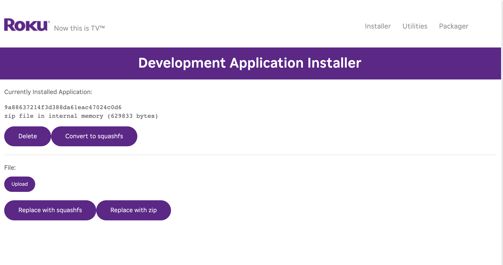
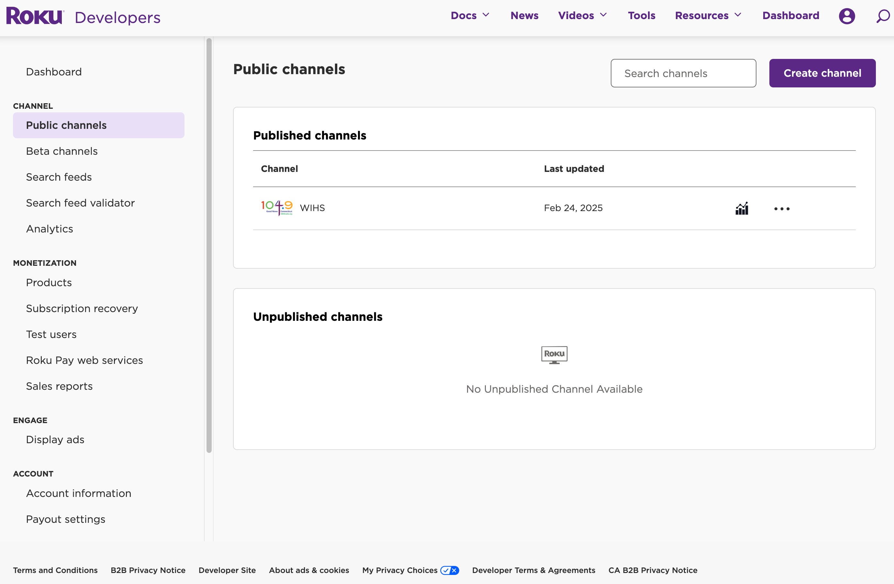

# WIHS
We're In His Service (Roku Channel)

This requires gnu's [make](https://www.gnu.org/software/make/) to be installed on the computer that you are working with.  

To build the package that gets installed and deployed within the Roku Platform in the root director at the same level as the README.md file you are reading type 
`make`. 

The make command will parse the Makefile and create a ./dist/apps/WIHS-Channel.zip file. 

The ./dist/apps/WIHS-Channel.zip file is deployed as the 'Channel' and the contents of the directory that make up this channel are as follows: 

```
.
├── Makefile
├── README.md
├── app.mk
├── components
│   └── audioscene.xml
├── dist
│   └── apps
│       └── WIHS-Channel.zip
├── fonts
│   └── sosa-regular-webfont.ttf
├── images
│   ├── channel-poster.jpg
│   ├── hartford_skyline.jpg
│   ├── rde_mm_focus_hd.jpg
│   ├── rde_mm_focus_sd.jpg
│   ├── rde_mm_focus_sd.png
│   ├── rde_splash_fhd.jpg
│   ├── rde_splash_hd.jpg
│   ├── rde_splash_sd.jpg
│   ├── rsgde_bg_hd.jpg
│   ├── rsgde_mm_focus_hd.jpg
│   ├── rsgde_splash_hd.jpg
│   └── wihs-logo.png
├── manifest
├── resources
│   ├── developer-dashboard.png
│   ├── installer-webserver.png
│   └── roku-developer-mode.png
└── source
    └── main.brs
```

In order to change this application and test it on an actual roku device you need to note the devices network address and get the device into side loading mode.  Side loading or [developer mode](https://developer.roku.com/docs/developer-program/getting-started/developer-setup.md) is entered into by pressing a special key squence on the device remote:

Home Home Home + Up Up + Right Left + Right Left + Right 

If all goes well then your roku device should look something like the screen below (keeping in mind that there are likely variations between models) 


From above it should be apparent that developer mode enables a screen where you can get the ip address so that you can go to your computer (on the same network) and enter the address into your computer browser.  The onboard webserver provides an uploading capability where you can upload the ./dist/apps/WIHS-Channel.zip file that was created in the 'making' step.  This screen is shown below: 



You will notice an installer, Utilities, and Packager options when logging into the webserver.  If you have trouble the on screen developer mode will allow you to set a password that should work when combined with rokudev. You can set the password to anything you like. 

* installer will install the channel.zip file to the roku device
* utilities provide debugging utilities for debugging the channel 
* packager provides a way to package up the channel for production deployment 

When you are happy with the result if you don't have an account out on roku.com create one, login and navigate to the developer dashboard which will allow you to view all public / published channels as well as beta channels.  

  

You can publish a beta channel and ultimately then publish the channel for consumption by any roku owner.  
